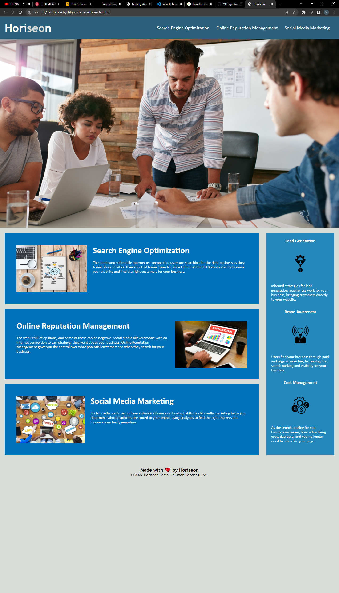

# CHALLENGE CODE REFACTOR

## Description

*Challenge Code Refactor* is an on-the-job ticket request from a marketing agency called Horiseon. They provided starter code and requested that I help them follow accessibility standards so that their website is optimized for search engines.

Horiseon provided a list of acceptance criteria. It goes as follows:

- ~~GIVEN a webpage meets accessibility standards~~

- ~~WHEN I view the source code~~
- ~~THEN I find semantic HTML elements~~

- ~~WHEN I view the structure of the HTML elements~~
- ~~THEN I find that the elements follow a logical structure independent of styling and positioning~~

- ~~WHEN I view the image elements~~
- ~~THEN I find accessible alt attributes~~

- ~~WHEN I view the heading attributes~~
- ~~THEN they fall in sequential order~~

- ~~WHEN I view the title element~~
- ~~THEN I find a concise, descriptive title~~


Furthermore,

Technical
- ~~Application links all function correctly~~
- ~~Application CSS selectors and properties are consolidated and organized to follow semantic structure~~
- ~~Application's CSS file is properly commented~~

Deployment
- ~~Application deployed at live URL~~
- ~~Application loads with no errors~~
- ~~Application GitHub URL submitted~~

Application Quality
- ~~Application resembles at least 90% of the original screenshots~~

Repository Quality

- ~~Repository has a unique name~~
- ~~Repository follows best practices for file structure and naming conventions~~
- ~~Repository follows best practices for class / id naming conventions, indentation, quality comments, etc.~~
- ~~Repository contains multiple descriptive commit messages~~
- ~~Repository contains quality README file with description, screenshots, and link to deployed application~~

## Installation
```
This section is intentionally brief.
```

- Virtual Studio Code @ https://code.visualstudio.com/

### Step 1: Install VSCode
Visit the provided link above, download VSCode to your corresponding operating system (Windows x64/Linux x64/macOS) and follow the wizard (installation guide).

### Step 2: Download the GitHub repository to your local repository
Visit the following link @ https://github.com/VMLujanJr/chlg_code_refactor

***If***! You downloaded the repository on a .zip, make sure to unzip the folder before the next step.

### Step 3: Open the Repository in VSCode
Go to **File**, click on **Open Folder**, and search for the directory where you downloaded the repository and press **Select Folder**.

Finally, navigate the **Explorer (Ctrl + Shift + E)** *if on Windows, inside of your VSCode to view contents.


## Usage

### Link to Deployed URL
View live URL @ https://vmlujanjr.github.io/chlg_code_refactor/

```
These are screenshots before and after the requested edits. 
```

### Before Edits


### After Edits


## Credits

A special thanks to the folks at Southern Methodist University for providing the starter code for this project @ https://smu.bootcampcontent.com/SMU-Coding-Bootcamp/SMU-VIRT-BO-FSF-PT-02-2022-U-B

## License

MIT License

Copyright (c) [2022] [VMLujanJr]

Permission is hereby granted, free of charge, to any person obtaining a copy
of this software and associated documentation files (the "Software"), to deal
in the Software without restriction, including without limitation the rights
to use, copy, modify, merge, publish, distribute, sublicense, and/or sell
copies of the Software, and to permit persons to whom the Software is
furnished to do so, subject to the following conditions:

The above copyright notice and this permission notice shall be included in all
copies or substantial portions of the Software.

THE SOFTWARE IS PROVIDED "AS IS", WITHOUT WARRANTY OF ANY KIND, EXPRESS OR
IMPLIED, INCLUDING BUT NOT LIMITED TO THE WARRANTIES OF MERCHANTABILITY,
FITNESS FOR A PARTICULAR PURPOSE AND NONINFRINGEMENT. IN NO EVENT SHALL THE
AUTHORS OR COPYRIGHT HOLDERS BE LIABLE FOR ANY CLAIM, DAMAGES OR OTHER
LIABILITY, WHETHER IN AN ACTION OF CONTRACT, TORT OR OTHERWISE, ARISING FROM,
OUT OF OR IN CONNECTION WITH THE SOFTWARE OR THE USE OR OTHER DEALINGS IN THE
SOFTWARE.